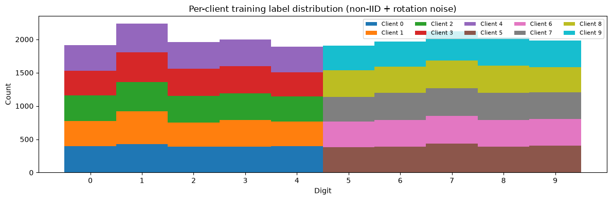
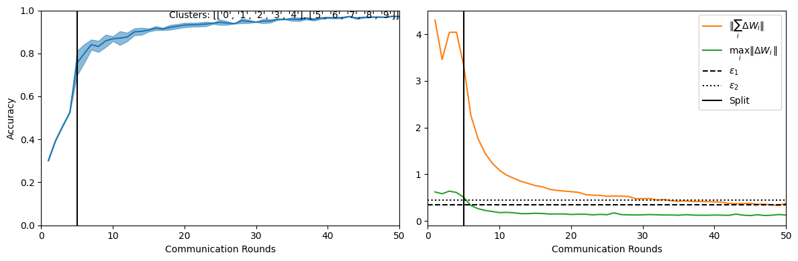
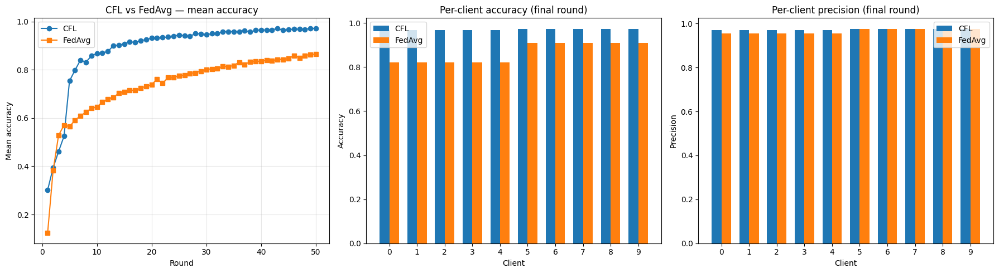

<p align="center">
  
</p>

# mimosa-fl: Clustered Federated Learning

> **Paper:** [Clustered Federated Learning: Model Isolation Distributed Training of Heterogeneous Data](https://arxiv.org/abs/1910.01991)
>
> **Labels:** `federated learning` `clustering` `heterogeneous data` `non-IID`
>
> **Dataset:** MNIST (non-IID)

**Authors:** Felix Sattler, Timothy Rolland, Wojciech Samek ([arXiv:1910.01991](https://arxiv.org/abs/1910.01991))

**Abstract:** Clustering FL is a new method for training federated models on heterogeneous data. Unlike standard FL, it detects dissimilarities between clients and assigns them to clusters so that each cluster holds statistically similar data only. This results in models that are up to 49% more accurate, converge up to 12x faster, and have up to 36% lower variance in convergence across clients.

## About this baseline

**What's implemented:** This baseline replicates the CFL algorithm from Sattler et al. using [Flower](https://github.com/flwrlabs/flower) as the FL framework. It implements:

- Recursive bi-partitioning of clients based on cosine similarity of weight updates
- A `ClusteredFLStrategy` that plugs into the standard Flower `Strategy` ABC
- Per-cluster model training with automatic client reassignment
- CFL vs FedAvg comparison on non-IID MNIST

**Datasets:** MNIST (pathological non-IID split: digits 0-4 vs 5-9)

**Hardware Setup:** Any machine with 4+ CPU cores. GPU optional (CPU-only by default).

## Experimental Setup

**Task:** Image classification

**Model:** Convolutional neural network (CNN) for MNIST

**Dataset:** 6 simulated clients holding non-IID MNIST data (digits 0-4 vs 5-9). Clients are split into two groups with disjoint digit distributions.

| Parameter | Default |
|---|---|
| total clients | 6 |
| clients per round | 6 |
| number of rounds | 10 |
| eps_1 (signal threshold) | 0.3 |
| eps_2 (divergence threshold) | 0.7 |
| min cluster size | 3 |
| data partition | pathological non-IID (digits 0-4 vs 5-9) |

## Environment Setup

```bash
python -m venv .venv
source .venv/bin/activate   # or: .venv\Scripts\activate on Windows

pip install -e .                        # install mimosa-fl
pip install -e examples/quickstart-cfl-pytorch   # + PyTorch
```

## Running the Experiments

**CFL (clustered):**

```bash
flwr run examples/quickstart-cfl-pytorch
```

**FedAvg baseline (for comparison):**

```bash
flwr run examples/quickstart-cfl-pytorch --run-config "strategy=fedavg"
```

**Using the mimosa CLI:**

```bash
mimosa run examples/quickstart-cfl-pytorch
mimosa tree examples/quickstart-cfl-pytorch   # view cluster tree
```

### Quickstart Notebook

For a step-by-step walkthrough with visualizations (training curves, cluster tree, per-client accuracy), see the notebook:

> [`examples/quickstart-cfl-pytorch/quickstart-cfl-pytorch.ipynb`](examples/quickstart-cfl-pytorch/quickstart-cfl-pytorch.ipynb)

## Expected Results

Results from the [quickstart notebook](examples/quickstart-cfl-pytorch/quickstart-cfl-pytorch.ipynb) with 10 simulated clients.

**Pre-processing:** Clients are split into two groups (digits 0-4 vs 5-9) to create a pathological non-IID distribution. Half of the clients also receive rotation noise (90 degrees) on their training samples, simulating real-world data heterogeneity where clients have similar but not identical distributions.

CFL detects the two data clusters at round 5 and splits into two sub-models. Each cluster then converges independently on its statistically similar clients.

| Method | Test Accuracy | Test Precision |
|---|---|---|
| FedAvg | ~70% | ~92% |
| CFL | ~90% | ~89% |

Precision is macro-averaged across all 10 clients. FedAvg shows slightly higher precision but much lower accuracy: its single global model is conservative (only fires when confident), while CFL's per-cluster models recover far more correct predictions - which is what drives the accuracy gap.

### Non-IID Data Distribution

Clients hold disjoint digit groups (0-4 vs 5-9) with rotation noise applied to half of them:



### Training Progress

CFL detects the split point automatically when the divergence signal exceeds thresholds (eps_1, eps_2):



### CFL vs FedAvg

CFL outperforms FedAvg on non-IID data, especially for clients in minority clusters (note that client ids 0-4 are the ones with noise):



The cluster tree after convergence:

```
Cluster 0
├── Cluster 1 (digits 0-4)
└── Cluster 2 (digits 5-9)
```

## Repository Layout

```
mimosa/                              Python package
tests/mimosa/                        unit + integration tests
examples/quickstart-cfl-pytorch/     minimal end-to-end example
docs/cfl/                            tutorial, strategy guide, API reference
```

## Testing

```bash
python -m pytest tests
```

85 tests covering similarity metrics, bi-partitioner, cluster-manager state machine, model registry, and full strategy pipeline.

## Citation

If you use this baseline in your work, please cite the original paper:

```bibtex
@article{sattler2019clustered,
  title={Clustered Federated Learning: Model Isolation Distributed Training of Heterogeneous Data},
  author={Sattler, Felix and Muller, Klaus-Robert and Samek, Wojciech},
  journal={arXiv preprint arXiv:1910.01991},
  year={2019}
}
```

## License

Apache-2.0 (inherited from Flower).
