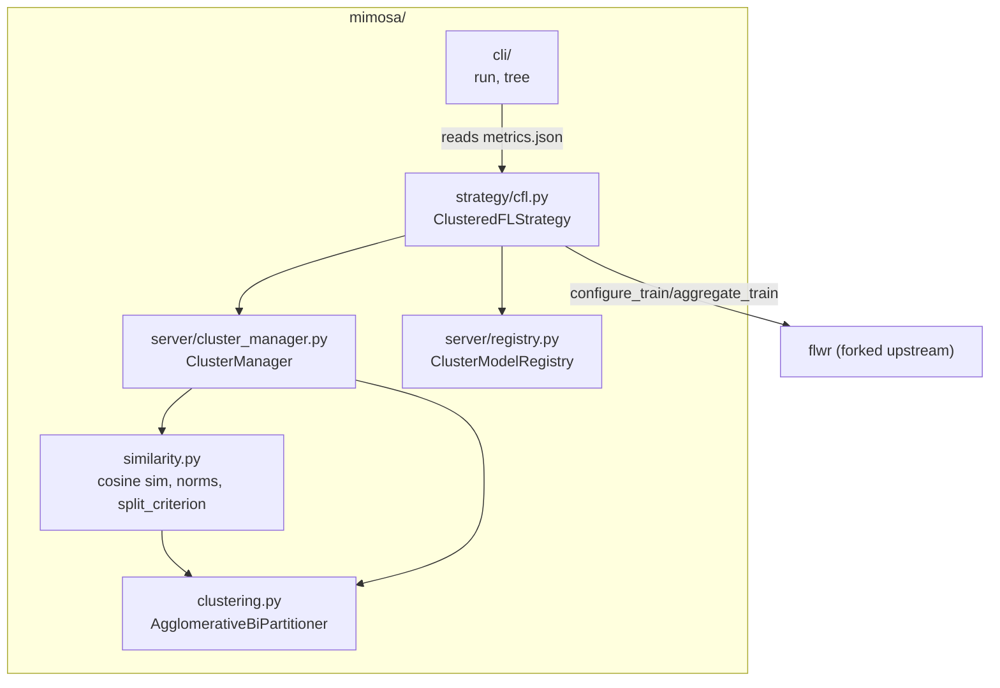

# Architecture

mimosa-fl is a **thin fork** of Flower that adds Clustered Federated Learning
(CFL, Sattler et al. arXiv:1910.01991) as a first-class capability.

## Component map

## Design decisions

1. **Modern message-based Strategy ABC.** `ClusteredFLStrategy` subclasses
   `flwr.serverapp.strategy.Strategy` (Flower >= 1.28) and implements the five
   abstract methods (`configure_train`, `aggregate_train`, `configure_evaluate`,
   `aggregate_evaluate`, `summary`), running over the Grid/ServerApp API. It
   also exposes the spec-named `configure_fit` / `aggregate_fit` /
   `initialize_parameters` methods as the testable round core.

2. **Server-side delta computation.** `dW = W_after - W_sent` is computed from
   the parameters the server sent each client — no client-side changes needed
   for core CFL (framework-agnostic).

3. **Pure-NumPy decision core.** `similarity.py`, `clustering.py`,
   `cluster_manager.py` and `registry.py` never import Flower, so they are
   unit-testable without a server.

4. **ClusterManager / registry split of responsibility.** `ClusterManager`
   decides and mutates the tree; `ClusterModelRegistry` stores models and
   implements inheritance on split. IDs stay in sync via explicit `child_id`.

5. **Soft membership.** Absent clients keep their last assignment; new clients
   join the root (or shallowest active) cluster.

## Version compatibility

Flower moved its message types between releases:

| Version | Message types | Grid |
|---|---|---|
| 1.28 – 1.30 | `flwr.common` | `flwr.server.Grid` |
| 1.31 – 1.33 | `flwr.app` | `flwr.serverapp.Grid` |

`mimosa/_compat.py` re-exports these from whichever location is installed.

## Docs integration

These pages live under `docs/cfl/` and are intended to build with Flower's
existing documentation toolchain (Sphinx/MkDocs). The API reference is written
to be auto-generated from docstrings in a follow-up.
